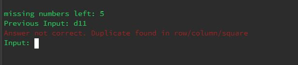

# Sudoku App

## Software Development Plan

---

## Application Purpose and Scope

**Describe at a high level what the application will do**

Sudoku is a number puzzle played on a 9x9 grid. The goal of the puzzle is to fill in the 9x9 grid with the numbers 1-9 abiding by the following rule. Each row, column, and 3x3 box cannot have two of the same number.

This application will allow the user to solve a standard 9x9 sudoku and generate a sudoku of varying difficulty to play.

**Identify the problem it will solve and explain why you are developing it**

The benefits of using this application:

- Improves concentration/memory
- Reduce stress and anxiety
- Promote a healthy mindset
- Helps kids develop their problem solving skills

Mental health is a global issue that can be supported from multiple fronts. This application can help people of all ages by stimulating their minds.

**Identify the target audience**

- Individuals who are interested in puzzles and board games
- Educators looking to help students improve focus/concentration/memory
- Businesses looking to give employees options to reduce stress

**Explain how a member of the target audience will use it**

A user with an unsolved Sudoku would open the Sudoku application. Then choose the solver option. Input their unsolved sudoku. Receive a solution to their Sudoku.

Having a little extra time on their hands the user would select the Play option in the navigation to generate a new Sudoku to play.

---

## Features

**Sudoku Solver**

The solver takes in the user's unsolved Sudoku 1 row at a time. Until all 9 rows have been completed. The solver will check if the Sudoku is valid(Follows the rules of Sudoku). Then proceeds to solve the Sudoku.

The algorithm chosen for this solver uses backtracking and recursion. The algorithm finds an empty cell denoted with a '0' starting from the top left, and loops through left to right and top to bottom. Then tries to find a valid number to place in the empty cell. If a valid number is found the solver function calls itself again to find the next empty cell after. If no valid number is found the function returns to the previous cell and tries the next valid number. This loop continues until the sudoku is solved.

Image below shows the input then the solver's solution.

**Sudoku Generator**

The Sudoku generator takes in the user input of difficulty(easy, medium, hard) and outputs a valid Sudoku. 

The method used to generate a Sudoku incorporates the python random module. A list of numbers 1 to 9 is shuffled. Then placed randomly on a 9x9 grid. The Sudoku generator uses the solve function to complete the Sudoku puzzle. Then numbers are removed randomly according to the difficulty selected by the user.

Image below shows the Sudoku generator for the medium difficulty.

**Play Mode**

The user is able to play a generated sudoku. The play function uses a coordinate system to take user input. The play function expects 3 characters.
The first character is the horizontal axis (a-i), the second character is the vertical axis (1-9), the last character is the user answer (1-9).

Image below shows the play function waiting for user input.

**Timer**

The timer feature shows the user how long they took to solve the generated Sudoku. The timer will wait for the user to press enter before beginning. Then stops when the user finishes the Sudoku.

Image below shows the finish time of a completed generated Sudoku.

**Difficulty**

The difficulty feature allows the user to generate Sudoku of varying difficulty. Easy, medium and hard are the options available. The difficulty determines how many numbers are missing in the generated sudoku.

Image below shows the difficulty options available to the user.

---

## User Interaction

**Sudoku Generator**

App Start > Navigation > (Solver option)

The Sudoku Generator option is shown to the user in the main navigation menu. The option can be selected with '1' or 'solver'. Upper case and spaces are removed for input leniency.

The user will input their unsolved Sudoku one row at a time.

The solver expects a string of 9 integers. Should the user deviate the application will show an error in colored text to the user.

Possible errors in solver:

User press 'enter' with no input

User enters 'back' when list is empty

User input is bigger or smaller than 9 characters

User input has characters other than 0-9

**Sudoku Generator**

App Start > Navigation > (Play option)

The user interacts with the generator by choosing the 'Play' option in the navigation. The user does not directly interact with the generator, but does influence the outcome by choosing a difficulty.

**Difficulty**

App Start > Navigation > (Play option) > (difficulty selection)

After choosing the play option the user will be required to choose a difficulty.

Should the user deviate from the choices given, an error in colored text will be shown.

**Timer**

App Start > Navigation > (Play option) > (difficulty selection) > (timer decision)

The user has the option to time their sudoku game. This option is available after choosing a difficulty. Only options are 'yes' and 'no'. If user deviates, an error message will be shown in colored text.

**Play Mode**

App Start > Navigation > (Play option) > (difficulty selection) > (timer decision) > (play mode)

The play feature is shown on the navigation menu. The user can select the play feature by typing '1' or 'Play'. The user will need to select a difficulty and timer before play can commence.

During play mode the user will be required to enter their answer using the application's notation. 3 character string is expected. The first character is the horizontal axis(a-i), the second character is the vertical axis(1-9), followed by the user's answer(1-9).

Possible errors during play: (errors found will be displayed in colored text)

Invalid move length - User input bigger or smaller than 3 characters

Invalid move - expecting (a-i)(1-9)(1-9)

Cannot overwrite cell - User tries to overwrite cell that is not originally empty

Duplicate found - User answer is already found in row/column/square

---

## Control Flow

---

## Implementation Plan

Implementation was split into 3 parts. Each with sub-goals. Start date was 11/7/2020

As this was my first time officially using an implementation plan. I opted to put due dates on categories instead of individual functions/sub-goals.

Implementation Plan, Developer Logs, and README are not included in breakdown as they were progressed alongside all 3 parts.

Solver was created first because the solver is used in the generator. Generator was created second because play requires a generated sudoku.

1. Solver (Due: 13/7/20 Duration: 2 days)

    0. Flow Diagram
    1. Print Grid
    2. Move Validation
    3. Whole Sudoku Validation
    4. Solve Function
    5. User input
    6. Error handling

2. Generator/Difficulty (Due: 15/7/20 Duration: 2 days)

    0. Flow Diagram extension
    1. Generate Sudoku (no difficulty modifier)
    2. Add difficulty modifier
    3. Ask/give solution after generation
    4. Error handling

3. Play Mode/Timer (Due: 17/7/20 Duration: 2 days)

    0. Flow Diagram extension
    1. Grid display with coordinates
    2. Play instructions
    3. List of empty cells (for overwrite error)
    4. Take user input
    5. Check move is valid
    6. Add move to grid
    7. Test: game finish
    8. Timer function
    9. Error handling
    

---

## Testing

---
